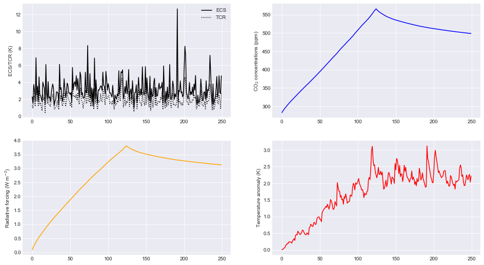

Examples
========

This notebook gives some simple examples of how to run and use the
Finite Amplitude Impulse Response (FAIR) model. For this demonstration
we will use the IPython notebook.

.. code:: ipython2

    %matplotlib inline

.. code:: ipython2

    import fair
    fair.__version__
    
    import numpy as np
    
    from matplotlib import pyplot as plt
    plt.style.use('seaborn-darkgrid')
    plt.rcParams['figure.figsize'] = (16, 9)

.. parsed-literal::

    '1.2.1+3.g64f29ef'

The "engine" of FAIR is the ``fair_scm`` function in the ``forward``
module.

.. code:: ipython2

    from fair.forward import fair_scm

CO2 driven run
--------------

Basic example
~~~~~~~~~~~~~

Here we show how FAIR can be run with step change CO\ :math:`_2`
emissions and sinusoidal non-CO\ :math:`_2` forcing timeseries. This is
a FAIR v1.0-style setup in which CO\ :math:`_2` is the only emitted
species.

In almost every application of FAIR you will probably want to vary the
``emissions`` time series going in to ``fair_scm``. In
CO\ :math:`_2`-only mode this is a 1D array of CO\ :math:`_2` emissions.
Setting ``useMultigas=False`` turns off the emissions from
non-CO\ :math:`_2` species.

The output from FAIR is a 3-tuple of ``(C,F,T)`` arrays. In
CO\ :math:`_2` mode, both ``C`` (representing CO\ :math:`_2`
concentrations in ppm) and ``F`` (total radiative forcing in W
m\ :math:`^{-2}`) are 1D arrays. ``T`` (temperature change since the
pre-industrial) is always output as a 1D array.

.. code:: ipython2

    # set up emissions and forcing arrays
    emissions = np.zeros(250)   # Unit: GtC
    emissions[125:] = 10.0
    other_rf = np.zeros(emissions.size)
    for x in range(0, emissions.size):
        other_rf[x] = 0.5 * np.sin(2 * np.pi * (x) / 14.0)
        
    # run the model
    C,F,T = fair.forward.fair_scm(
        emissions=emissions,
        other_rf=other_rf,
        useMultigas=False
    )
    
    # plot the output
    fig = plt.figure()
    ax1 = fig.add_subplot(221)
    ax1.plot(range(0, emissions.size), emissions, color='black')
    ax1.set_ylabel('Emissions (GtC)')
    ax2 = fig.add_subplot(222)
    ax2.plot(range(0, emissions.size), C, color='blue')
    ax2.set_ylabel('CO$_2$ concentrations (ppm)')
    ax3 = fig.add_subplot(223)
    ax3.plot(range(0, emissions.size), F, color='orange')
    ax3.set_ylabel('Radiative forcing (W.m$^{-2}$)')
    ax4 = fig.add_subplot(224)
    ax4.plot(range(0, emissions.size), T, color='red')
    ax4.set_ylabel('Temperature anomaly (K)');

.. image:: examples_files/examples_6_0.png

Forcing-only runs
~~~~~~~~~~~~~~~~~

If you want to specify a pure forcing and bypass the carbon cycle
routine this is also possible by setting ``emissions=False``. This time,
we will add a linear forcing to the sinusodal forcing above. Note that
the CO\ :math:`_2` concentrations are not updated from their
pre-industrial value.

.. code:: ipython2

    # Define a forcing time series
    for x in range(0, emissions.size):
        other_rf[x] = 0.02*x + 0.5 * np.sin(2 * np.pi * (x) / 14.0)
        
    # run the model with emissions off
    _,F,T = fair.forward.fair_scm(
        emissions=False,
        other_rf=other_rf,
        useMultigas=False
    )
    
    # plot the output
    fig = plt.figure()
    ax1 = fig.add_subplot(221)
    ax1.plot(range(0, other_rf.size), F, color='orange')
    ax1.set_ylabel('Radiative forcing (W.m$^{-2}$)')
    ax1 = fig.add_subplot(222)
    ax1.plot(range(0, other_rf.size), T, color='red')
    ax1.set_ylabel('Temperature anomaly (K)');

.. image:: examples_files/examples_8_0.png

Varying the carbon cycle parameters
~~~~~~~~~~~~~~~~~~~~~~~~~~~~~~~~~~~

FAIR is set up to simulate the responses to more complex earth system
models. This is achieved by a scaling of a four-box decay model for
atmospheric carbon dioxide emissions based on the airborne fraction of
carbon dioxide. This in turn depends on the efficiency of carbon sinks,
which is a function of temperature change and total accumulated carbon
uptake. Much of the technical detail is described in `Millar et al.,
(2017) <https://www.atmos-chem-phys.net/17/7213/2017/acp-17-7213-2017.html>`__.

In the carbon cycle, the important variables are ``r0``, ``rc`` and
``rt`` which are in turn the pre-industrial sensitivity of carbon sinks,
the sensitivity to cumulative carbon dioxide emissions, and sensitivity
to temperature change.

This time we will demonstrate with a 10 Gt constant pulse and use a
10-member ensemble.

.. code:: ipython2

    # set up emissions and forcing arrays
    emissions = np.ones(250) * 10.0   # Unit: GtC
    emissions[125:] = 0.0
    other_rf = np.zeros(emissions.size)
    for x in range(0, emissions.size):
        other_rf[x] = 0.5 * np.sin(2 * np.pi * (x) / 14.0)
    
    # create output arrays 
    nrun = 10
    C = np.empty((emissions.size, nrun))
    F = np.empty((emissions.size, nrun))
    T = np.empty((emissions.size, nrun))
    
    # Generate some random values of carbon cycle parameters
    from scipy.stats import norm
    r0 = norm.rvs(size=nrun, loc=35, scale=5.0)
    rc = norm.rvs(size=nrun, loc=0.019, scale=0.003)
    rt = norm.rvs(size=nrun, loc=4.165, scale=0.5)
    
    print (r0)
    print (rc)
    print (rt)
    
    # run the model
    for i in range(nrun):
        C[:,i],F[:,i],T[:,i] = fair.forward.fair_scm(
            emissions=emissions,
            other_rf=other_rf,
            useMultigas=False,
            r0 = r0[i],
            rc = rc[i],
            rt = rt[i]
        )
    
    # plot the output
    fig = plt.figure()
    ax1 = fig.add_subplot(221)
    ax1.plot(range(0, emissions.size), emissions, color='black')
    ax1.set_ylabel('Emissions (GtC)')
    ax2 = fig.add_subplot(222)
    ax2.plot(range(0, emissions.size), C)
    ax2.set_ylabel('CO$_2$ concentrations (ppm)')
    ax3 = fig.add_subplot(223)
    ax3.plot(range(0, emissions.size), F)
    ax3.set_ylabel('Radiative forcing (W.m$^{-2}$)')
    ax4 = fig.add_subplot(224)
    ax4.plot(range(0, emissions.size), T)
    ax4.set_ylabel('Temperature anomaly (K)');

.. parsed-literal::

    [31.0587648  27.73528132 39.0325918  31.50586045 40.17227681 28.9323189
     33.79840708 29.6779254  24.20317026 33.82558451]
    [0.01495035 0.02152929 0.0185049  0.02253518 0.020316   0.02296456
     0.01583876 0.02025348 0.02114155 0.01736782]
    [4.2992202  4.26948499 5.08742388 4.08681291 4.71214769 4.21114884
     4.18007727 3.45074113 4.29462521 4.88244346]

.. image:: examples_files/examples_10_1.png

Changing CO2 lifetime and partitioning coefficients
~~~~~~~~~~~~~~~~~~~~~~~~~~~~~~~~~~~~~~~~~~~~~~~~~~~

The CO\ :math:`_2` lifetime and partitioning coefficients are quantified
by the ``tau`` and ``a`` parameters respectively. The rationale follows
the four-box model in AR5. First we'll run with the defaults and then
change them.

In the second figure it can be seen that these parameter settings are
important for the rate of decay of atmospheric CO\ :math:`_2`.

.. code:: ipython2

    # set up emissions and forcing arrays
    emissions = np.ones(250) * 10.0   # Unit: GtC
    emissions[125:] = 0.0
    other_rf = np.zeros(emissions.size)
    for x in range(0, emissions.size):
        other_rf[x] = 0.5 * np.sin(2 * np.pi * (x) / 14.0)
    
    # create output arrays 
    nrun=3
    C = np.empty((emissions.size, nrun))
    F = np.empty((emissions.size, nrun))
    T = np.empty((emissions.size, nrun))
    
    # Play with the carbon boxes
    tau2 = np.array([1e6, 400.0, 100.0, 5.0])
    a2   = np.ones(4) * 0.25
    
    # Nobody said we had to stick to a four-box model...
    tau3 = np.array([1e6, 1000.0, 150.0, 70.0, 15.0, 3.0])
    a3   = np.array([0.1, 0.2, 0.2, 0.2, 0.2, 0.1])
    
    # run the model for default case
    C[:,0],F[:,0],T[:,0] = fair.forward.fair_scm(
        emissions=emissions,
        other_rf=other_rf,
        useMultigas=False)
    
    # ... and for our alternatives
    C[:,1],F[:,1],T[:,1] = fair.forward.fair_scm(
        emissions=emissions,
        other_rf=other_rf,
        useMultigas=False,
        tau=tau2,
        a=a2)
    C[:,2],F[:,2],T[:,2] = fair.forward.fair_scm(
        emissions=emissions,
        other_rf=other_rf,
        useMultigas=False,
        tau=tau3,
        a=a3)
    
    # plot the output
    fig = plt.figure()
    ax1 = fig.add_subplot(221)
    ax1.plot(range(0, emissions.size), emissions, color='black')
    ax1.set_ylabel('Emissions (GtC)')
    ax2 = fig.add_subplot(222)
    ax2.plot(range(0, emissions.size), C)
    ax2.set_ylabel('CO$_2$ concentrations (ppm)')
    ax3 = fig.add_subplot(223)
    ax3.plot(range(0, emissions.size), F)
    ax3.set_ylabel('Radiative forcing (W.m$^{-2}$)')
    ax4 = fig.add_subplot(224)
    ax4.plot(range(0, emissions.size), T)
    ax4.set_ylabel('Temperature anomaly (K)');

.. image:: examples_files/examples_12_0.png

RCPs
----

We can run FAIR with the CO\ :math:`_2` emissions and non-CO\ :math:`_2`
forcing from the four representative concentration pathway scenarios. To
use the emissions-based version specify ``useMultigas=True`` in the call
to ``fair_scm()``.

By default in multi-gas mode, volcanic and solar forcing plus natural
emissions of methane and nitrous oxide are switched on.

.. code:: ipython2

    from fair.RCPs import rcp3pd, rcp45, rcp6, rcp85
    
    fig = plt.figure()
    ax1 = fig.add_subplot(221)
    ax2 = fig.add_subplot(222)
    ax3 = fig.add_subplot(223)
    ax4 = fig.add_subplot(224)
    
    C26, F26, T26 = fair.forward.fair_scm(emissions=rcp3pd.Emissions.emissions)
    ax1.plot(rcp3pd.Emissions.year, rcp3pd.Emissions.co2_fossil, color='green', label='RCP3PD')
    ax2.plot(rcp3pd.Emissions.year, C26[:, 0], color='green')
    ax3.plot(rcp3pd.Emissions.year, np.sum(F26, axis=1), color='green')
    ax4.plot(rcp3pd.Emissions.year, T26, color='green')
    
    C45, F45, T45 = fair.forward.fair_scm(emissions=rcp45.Emissions.emissions)
    ax1.plot(rcp45.Emissions.year, rcp45.Emissions.co2_fossil, color='blue', label='RCP4.5')
    ax2.plot(rcp45.Emissions.year, C45[:, 0], color='blue')
    ax3.plot(rcp45.Emissions.year, np.sum(F45, axis=1), color='blue')
    ax4.plot(rcp45.Emissions.year, T45, color='blue')
    
    C60, F60, T60 = fair.forward.fair_scm(emissions=rcp6.Emissions.emissions)
    ax1.plot(rcp6.Emissions.year, rcp6.Emissions.co2_fossil, color='red', label='RCP6')
    ax2.plot(rcp6.Emissions.year, C60[:, 0], color='red')
    ax3.plot(rcp6.Emissions.year, np.sum(F60, axis=1), color='red')
    ax4.plot(rcp6.Emissions.year, T60, color='red')
    
    C85, F85, T85 = fair.forward.fair_scm(emissions=rcp85.Emissions.emissions)
    ax1.plot(rcp85.Emissions.year, rcp85.Emissions.co2_fossil, color='black', label='RCP8.5')
    ax2.plot(rcp85.Emissions.year, C85[:, 0], color='black')
    ax3.plot(rcp85.Emissions.year, np.sum(F85, axis=1), color='black')
    ax4.plot(rcp85.Emissions.year, T85, color='black')
    
    ax1.set_ylabel('Fossil CO$_2$ Emissions (GtC)')
    ax1.legend()
    ax2.set_ylabel('CO$_2$ concentrations (ppm)')
    ax3.set_ylabel('Total radiative forcing (W.m$^{-2}$)')
    ax4.set_ylabel('Temperature anomaly (K)');

.. image:: examples_files/examples_14_0.png

Concentrations of well-mixed greenhouse gases
---------------------------------------------

The output of FAIR (in most cases) is a 3-element tuple of
concentrations, effective radiative forcing and temperature change since
pre-industrial. Concentrations are a 31-column array of greenhouse
gases. The indices correspond to the order given in the RCP
concentration datasets (table 2 in Smith et al.,
https://www.geosci-model-dev-discuss.net/gmd-2017-266/). We can
investigate the GHG concentrations coming out of the model:

.. code:: ipython2

    fig = plt.figure()
    ax1 = fig.add_subplot(221)
    ax2 = fig.add_subplot(222)
    ax3 = fig.add_subplot(223)
    ax4 = fig.add_subplot(224)
    
    ax1.plot(rcp3pd.Emissions.year, C26[:,1], color='green', label='RCP3PD')
    ax1.plot(rcp45.Emissions.year, C45[:,1], color='blue', label='RCP4.5')
    ax1.plot(rcp6.Emissions.year, C60[:,1], color='red', label='RCP6')
    ax1.plot(rcp85.Emissions.year, C85[:,1], color='black', label='RCP8.5')
    ax1.set_title("Methane concentrations, ppb")
    
    ax2.plot(rcp3pd.Emissions.year, C26[:,2], color='green', label='RCP3PD')
    ax2.plot(rcp45.Emissions.year, C45[:,2], color='blue', label='RCP4.5')
    ax2.plot(rcp6.Emissions.year, C60[:,2], color='red', label='RCP6')
    ax2.plot(rcp85.Emissions.year, C85[:,2], color='black', label='RCP8.5')
    ax2.set_title("Nitrous oxide concentrations, ppb")
    
    # How to convert the H and F gases to single-species equivalents? Weight by radiative efficiency.
    from fair.constants import radeff
    C26_hfc134a_eq = np.sum(C26[:,3:15]*radeff.aslist[3:15],axis=1)/radeff.HFC134A   # indices 3:15 are HFCs and PFCs
    C45_hfc134a_eq = np.sum(C45[:,3:15]*radeff.aslist[3:15],axis=1)/radeff.HFC134A
    C60_hfc134a_eq = np.sum(C60[:,3:15]*radeff.aslist[3:15],axis=1)/radeff.HFC134A
    C85_hfc134a_eq = np.sum(C85[:,3:15]*radeff.aslist[3:15],axis=1)/radeff.HFC134A
    
    C26_cfc12_eq = np.sum(C26[:,15:31]*radeff.aslist[15:31],axis=1)/radeff.CFC12   # indices 15:31 are ozone depleters
    C45_cfc12_eq = np.sum(C45[:,15:31]*radeff.aslist[15:31],axis=1)/radeff.CFC12
    C60_cfc12_eq = np.sum(C60[:,15:31]*radeff.aslist[15:31],axis=1)/radeff.CFC12
    C85_cfc12_eq = np.sum(C85[:,15:31]*radeff.aslist[15:31],axis=1)/radeff.CFC12
    
    ax3.plot(rcp3pd.Emissions.year, C26_hfc134a_eq, color='green', label='RCP3PD')
    ax3.plot(rcp45.Emissions.year, C45_hfc134a_eq, color='blue', label='RCP4.5')
    ax3.plot(rcp6.Emissions.year, C60_hfc134a_eq, color='red', label='RCP6')
    ax3.plot(rcp85.Emissions.year, C85_hfc134a_eq, color='black', label='RCP8.5')
    ax3.set_title("HFC134a equivalent concentrations, ppt")
    
    ax4.plot(rcp3pd.Emissions.year, C26_cfc12_eq, color='green', label='RCP3PD')
    ax4.plot(rcp45.Emissions.year, C45_cfc12_eq, color='blue', label='RCP4.5')
    ax4.plot(rcp6.Emissions.year, C60_cfc12_eq, color='red', label='RCP6')
    ax4.plot(rcp85.Emissions.year, C85_cfc12_eq, color='black', label='RCP8.5')
    ax4.set_title("CFC12 equivalent concentrations, ppt")
    ax1.legend()

.. parsed-literal::

    <matplotlib.legend.Legend at 0x7f7ef86e6850>

.. image:: examples_files/examples_16_1.png

Radiative forcing
-----------------

We consider 13 separate species of radiative forcing: CO\ :math:`_2`,
CH\ :math:`_4`, N\ :math:`_2`\ O, minor GHGs, tropospheric ozone,
stratospheric ozone, stratospheric water vapour from methane oxidation,
contrails, aerosols, black carbon on snow, land use change, volcanic and
solar (table 1 in Smith et al.,
https://www.geosci-model-dev-discuss.net/gmd-2017-266/). Here we show
some of the more interesting examples.

.. code:: ipython2

    fig = plt.figure()
    ax1 = fig.add_subplot(221)
    ax2 = fig.add_subplot(222)
    ax3 = fig.add_subplot(223)
    ax4 = fig.add_subplot(224)
    
    ax1.plot(rcp3pd.Emissions.year, F26[:,4], color='green', label='RCP3PD')
    ax1.plot(rcp45.Emissions.year, F45[:,4], color='blue', label='RCP4.5')
    ax1.plot(rcp6.Emissions.year, F60[:,4], color='red', label='RCP6')
    ax1.plot(rcp85.Emissions.year, F85[:,4], color='black', label='RCP8.5')
    ax1.set_title("Tropospheric ozone forcing, W m$^{-2}$")
    
    ax2.plot(rcp3pd.Emissions.year, F26[:,5], color='green', label='RCP3PD')
    ax2.plot(rcp45.Emissions.year, F45[:,5], color='blue', label='RCP4.5')
    ax2.plot(rcp6.Emissions.year, F60[:,5], color='red', label='RCP6')
    ax2.plot(rcp85.Emissions.year, F85[:,5], color='black', label='RCP8.5')
    ax2.set_title("Stratospheric ozone forcing, W m$^{-2}$")
    
    ax3.plot(rcp3pd.Emissions.year, F26[:,8], color='green', label='RCP3PD')
    ax3.plot(rcp45.Emissions.year, F45[:,8], color='blue', label='RCP4.5')
    ax3.plot(rcp6.Emissions.year, F60[:,8], color='red', label='RCP6')
    ax3.plot(rcp85.Emissions.year, F85[:,8], color='black', label='RCP8.5')
    ax3.set_title("Aerosol forcing, W ~m$^{-2}$")
    
    ax4.plot(rcp3pd.Emissions.year, F26[:,10], color='green', label='RCP3PD')
    ax4.plot(rcp45.Emissions.year, F45[:,10], color='blue', label='RCP4.5')
    ax4.plot(rcp6.Emissions.year, F60[:,10], color='red', label='RCP6')
    ax4.plot(rcp85.Emissions.year, F85[:,10], color='black', label='RCP8.5')
    ax4.set_title("Land use forcing, W m$^{-2}$")
    ax1.legend();

.. image:: examples_files/examples_18_0.png

Ensemble generation
-------------------

An advantage of FAIR is that it is very quick to run (much less than a
second on an average machine). Therefore it can be used to generate
probabilistic future ensembles. We'll show a 100-member ensemble.

.. code:: ipython2

    from scipy import stats
    
    # generate some (bad) TCR and ECS pairs
    tcrecs = stats.norm.rvs(size=(100,2), loc=[1.75,3], scale=[0.4,0.8], random_state=38571)
    
    # generate some forcing scale factors with SD of 10% of the best estimate
    F_scale = stats.norm.rvs(size=(100,13), loc=1, scale=0.1, random_state=40000)
    
    # do the same for the carbon cycle parameters
    r0 = stats.norm.rvs(size=100, loc=35, scale=3.5, random_state=41000)
    rc = stats.norm.rvs(size=100, loc=0.019, scale=0.0019, random_state=42000)
    rt = stats.norm.rvs(size=100, loc=4.165, scale=0.4165, random_state=45000)
    
    T = np.zeros((736,100))
    
    %time
    for i in range(100):
        _, _, T[:,i] = fair.forward.fair_scm(emissions=rcp85.Emissions.emissions,
                            r0 = r0[i],
                            rc = rc[i],
                            rt = rt[i],
                            tcrecs = tcrecs[i,:],
                            scale = F_scale[i,:],
                            F2x = 3.74*F_scale[i,0])   # scale F2x with the CO2 scaling factor for consistency

.. parsed-literal::

    CPU times: user 0 ns, sys: 0 ns, total: 0 ns
    Wall time: 7.15 µs

.. code:: ipython2

    fig = plt.figure()
    ax1 = fig.add_subplot(111)
    ax1.plot(rcp85.Emissions.year, T);

The resulting projections show a large spread. Some of these ensemble
members are unrealistic, ranging from around 0.4 to 2.0 K temperature
change in the present day, whereas we know in reality it is more like
0.9 (plus or minus 0.2). Therefore we can constrain this ensemble to
observations.

.. code:: ipython2

    from fair.tools.constrain import hist_temp
    CW = np.loadtxt('fair/tools/tempobs/had4_krig_annual_v2_0_0.txt')  # Cowtan & Way in-filled dataset of global temperatures
    constrained = np.zeros(100, dtype=bool)
    for i in range(100):
        # we use observed trend from 1880 to 2016
        constrained[i] = hist_temp(CW[30:,1], T[1880-1765:2017-1765,i], CW[30:,0])

.. code:: ipython2

    # How many ensemble members passed the constraint?
    print np.sum(constrained)

.. parsed-literal::

    54

.. code:: ipython2

    # What does this do to the ensemble?
    fig = plt.figure()
    ax1 = fig.add_subplot(111)
    ax1.plot(rcp85.Emissions.year, T[:,constrained]);

.. image:: examples_files/examples_25_0.png

Some, but not all, of the higher end scenarios have been constrained
out, but there is still quite a large range of total temperature change
projected for 2500 even under this constraint.

From these constraints it is possible to obtain posterior distributions
on effective radiative forcing, ECS, TCR, TCRE and other metrics.

