Examples
========

Here are some simple examples of how to run and use the Finite Amplitude
Impulse Response (FAIR) model run in the jupyter notebook.

.. code:: ipython2

    %matplotlib inline

.. code:: ipython2

    import fair
    fair.__version__
    
    import numpy as np
    
    from matplotlib import pyplot as plt
    plt.style.use('seaborn-darkgrid')
    plt.rcParams['figure.figsize'] = (16, 9)

The "engine" of FAIR is the ``fair_scm`` function in the ``forward``
module.

.. code:: ipython2

    from fair.forward import fair_scm

CO2 driven run
--------------

Basic example
~~~~~~~~~~~~~

Here we show how FAIR can be run with step change CO2 emissions and
sinusoidal non-CO2 forcing timeseries. This is a FAIR v1.0-style setup
in which CO2 is the only emitted species.

In almost every application of FAIR you will probably want to vary the
``emissions`` time series going in to ``fair_scm``. In CO2-only mode
this is a 1D array of CO2 emissions. Setting ``useMultigas=False`` turns
off the emissions from non-CO2 species.

The output from FAIR is a 3-tuple of ``(C,F,T)`` arrays. In CO2 mode,
both ``C`` (representing CO2 concentrations in ppm) and ``F`` (total
radiative forcing in W m-2) are 1D arrays. ``T`` (temperature change
since the pre-industrial) is always output as a 1D array.

.. code:: ipython2

    # set up emissions and forcing arrays
    emissions = np.zeros(250)   # Unit: GtC
    emissions[125:] = 10.0
    other_rf = np.zeros(emissions.size)
    for x in range(0, emissions.size):
        other_rf[x] = 0.5 * np.sin(2 * np.pi * (x) / 14.0)
        
    # run the model
    C,F,T = fair.forward.fair_scm(
        emissions=emissions,
        other_rf=other_rf,
        useMultigas=False
    )
    
    # plot the output
    fig = plt.figure()
    ax1 = fig.add_subplot(221)
    ax1.plot(range(0, emissions.size), emissions, color='black')
    ax1.set_ylabel('Emissions (GtC)')
    ax2 = fig.add_subplot(222)
    ax2.plot(range(0, emissions.size), C, color='blue')
    ax2.set_ylabel('CO$_2$ concentrations (ppm)')
    ax3 = fig.add_subplot(223)
    ax3.plot(range(0, emissions.size), F, color='orange')
    ax3.set_ylabel('Radiative forcing (W m$^{-2}$)')
    ax4 = fig.add_subplot(224)
    ax4.plot(range(0, emissions.size), T, color='red')
    ax4.set_ylabel('Temperature anomaly (K)');

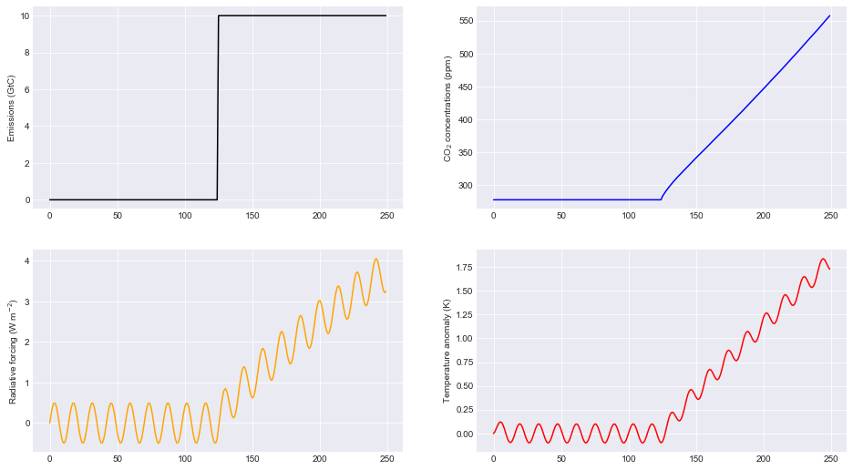

Forcing-only runs
~~~~~~~~~~~~~~~~~

If you want to specify a pure forcing and bypass the carbon cycle
routine this is also possible by setting ``emissions=False``. This time,
we will add a linear forcing to the sinusodal forcing above. Note that
the CO2 concentrations are not updated from their pre-industrial value.

.. code:: ipython2

    # Define a forcing time series
    for x in range(0, emissions.size):
        other_rf[x] = 0.02*x + 0.5 * np.sin(2 * np.pi * (x) / 14.0)
        
    # run the model with emissions off
    _,F,T = fair.forward.fair_scm(
        emissions=False,
        other_rf=other_rf,
        useMultigas=False
    )
    
    # plot the output
    fig = plt.figure()
    ax1 = fig.add_subplot(221)
    ax1.plot(range(0, other_rf.size), F, color='orange')
    ax1.set_ylabel('Radiative forcing (W m$^{-2}$)')
    ax1 = fig.add_subplot(222)
    ax1.plot(range(0, other_rf.size), T, color='red')
    ax1.set_ylabel('Temperature anomaly (K)');

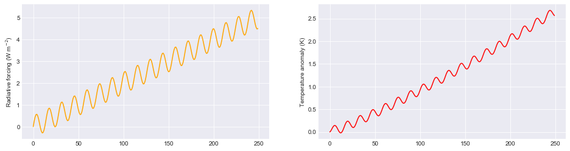

Varying the carbon cycle parameters
~~~~~~~~~~~~~~~~~~~~~~~~~~~~~~~~~~~

FAIR is set up to simulate the responses to more complex earth system
models. This is achieved by a scaling of a four-box decay model for
atmospheric carbon dioxide emissions based on the airborne fraction of
carbon dioxide. This in turn depends on the efficiency of carbon sinks,
which is a function of temperature change and total accumulated carbon
uptake. Much of the technical detail is described in `Millar et al.,
(2017) <https://www.atmos-chem-phys.net/17/7213/2017/acp-17-7213-2017.html>`__.

In the carbon cycle, the important variables are ``r0``, ``rc`` and
``rt`` which are in turn the pre-industrial sensitivity of carbon sinks,
the sensitivity to cumulative carbon dioxide emissions, and sensitivity
to temperature change.

This time we will demonstrate with a 10 Gt constant pulse and use a
10-member ensemble.

.. code:: ipython2

    # set up emissions and forcing arrays
    emissions = np.ones(250) * 10.0   # Unit: GtC
    emissions[125:] = 0.0
    other_rf = np.zeros(emissions.size)
    for x in range(0, emissions.size):
        other_rf[x] = 0.5 * np.sin(2 * np.pi * (x) / 14.0)
    
    # create output arrays 
    nrun = 10
    C = np.empty((emissions.size, nrun))
    F = np.empty((emissions.size, nrun))
    T = np.empty((emissions.size, nrun))
    
    # Generate some random values of carbon cycle parameters
    # use a seed for reproducible results
    from scipy.stats import norm
    r0 = norm.rvs(size=nrun, loc=35, scale=5.0, random_state=42)
    rc = norm.rvs(size=nrun, loc=0.019, scale=0.003, random_state=77)
    rt = norm.rvs(size=nrun, loc=4.165, scale=0.5, random_state=1729)
    
    # initialise plot
    fig = plt.figure()
    ax1 = fig.add_subplot(221)
    ax1.plot(range(0, emissions.size), emissions, color='black')
    ax1.set_ylabel('Emissions (GtC)')
    ax2 = fig.add_subplot(222)
    ax3 = fig.add_subplot(223)
    ax4 = fig.add_subplot(224)
    # run the model and plot outputs
    print ("run      r0     rc    rt")
    for i in range(nrun):
        print ("  %d  %5.3f %5.4f %5.3f" % (i, r0[i], rc[i], rt[i]))
        C[:,i],F[:,i],T[:,i] = fair.forward.fair_scm(
            emissions=emissions,
            other_rf=other_rf,
            useMultigas=False,
            r0 = r0[i],
            rc = rc[i],
            rt = rt[i]
        )
        ax2.plot(range(0, emissions.size), C[:,i], label='run %d' % i)
        ax2.set_ylabel('CO$_2$ concentrations (ppm)')
        ax3.plot(range(0, emissions.size), F[:,i])
        ax3.set_ylabel('Radiative forcing (W m$^{-2}$)')
        ax4.plot(range(0, emissions.size), T[:,i])
        ax4.set_ylabel('Temperature anomaly (K)');
    ax2.legend();

.. parsed-literal::

    run      r0     rc    rt
      0  37.484 0.0197 3.821
      1  34.309 0.0210 3.755
      2  38.238 0.0173 4.991
      3  42.615 0.0202 3.877
      4  33.829 0.0204 4.714
      5  33.829 0.0131 4.628
      6  42.896 0.0198 3.668
      7  38.837 0.0143 3.736
      8  32.653 0.0237 4.202
      9  37.713 0.0168 4.430

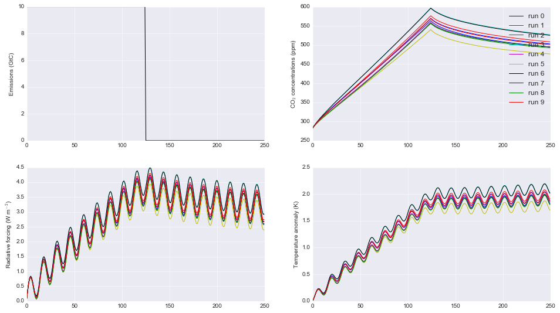

Changing CO2 lifetime and partitioning coefficients
~~~~~~~~~~~~~~~~~~~~~~~~~~~~~~~~~~~~~~~~~~~~~~~~~~~

The CO2 initial lifetime and partitioning coefficients are quantified by
the ``tau`` and ``a`` parameters respectively. The rationale follows the
four-box model in `Myhre et al.
(2013) <https://www.ipcc.ch/pdf/assessment-report/ar5/wg1/supplementary/WG1AR5_Ch08SM_FINAL.pdf>`__,
scaled by the impact of land and ocean carbon uptake as described in
`Millar et al.,
(2017) <https://www.atmos-chem-phys.net/17/7213/2017/acp-17-7213-2017.html>`__.

``tau``, in years, is the time constant for each carbon pool and is
ordered from slowest carbon pool to fastest, and ``a`` is the fraction
of new CO2 emissions going in to each pool. The first element of ``tau``
is usually very large and represents the fraction of CO2 emissions that
remain in the atmosphere "quasi-permanently", i.e. removed only on
geological time scales, far past the range of times in which FAIR is
expected to give useful results (although nobody will stop you using a
smaller value as we demonstrate). An error should be thrown if the sum
of ``a`` is not one.

In the second figure it can be seen that these parameter settings are
important for the rate of decay of atmospheric CO2 in particular.

.. code:: ipython2

    # set up emissions and forcing arrays
    emissions = np.ones(250) * 10.0   # Unit: GtC
    emissions[125:] = 0.0
    other_rf = np.zeros(emissions.size)
    for x in range(0, emissions.size):
        other_rf[x] = 0.5 * np.sin(2 * np.pi * (x) / 14.0)
    
    # create output arrays 
    nrun=4
    C = np.empty((emissions.size, nrun))
    F = np.empty((emissions.size, nrun))
    T = np.empty((emissions.size, nrun))
    
    # Play with the carbon boxes
    tau2 = np.array([1e6, 400.0, 100.0, 5.0])
    a2   = np.ones(4) * 0.25
    
    # Nobody said we had to stick to a four-box model...
    tau3 = np.array([1e6, 1000.0, 150.0, 70.0, 15.0, 3.0])
    a3   = np.array([0.1, 0.2, 0.2, 0.2, 0.2, 0.1])
    
    # A pathological case where tau0 is much smaller than 1e6
    # in this example CO2 behaves more like other GHGs
    tau4 = np.array([10., 4., 1., 0.3])
    a4   = np.ones(4) * 0.25
    
    # run the model for default values
    C[:,0],F[:,0],T[:,0] = fair.forward.fair_scm(
        emissions=emissions,
        other_rf=other_rf,
        useMultigas=False)
    
    # ... and for our alternatives
    C[:,1],F[:,1],T[:,1] = fair.forward.fair_scm(
        emissions=emissions,
        other_rf=other_rf,
        useMultigas=False,
        tau=tau2,
        a=a2)
    C[:,2],F[:,2],T[:,2] = fair.forward.fair_scm(
        emissions=emissions,
        other_rf=other_rf,
        useMultigas=False,
        tau=tau3,
        a=a3)
    C[:,3],F[:,3],T[:,3] = fair.forward.fair_scm(
        emissions=emissions,
        other_rf=other_rf,
        useMultigas=False,
        tau=tau4,
        a=a4)
    
    # plot the output
    fig = plt.figure()
    ax1 = fig.add_subplot(221)
    ax1.plot(range(0, emissions.size), emissions, color='black')
    ax1.set_ylabel('Emissions (GtC)')
    ax2 = fig.add_subplot(222)
    handles = ax2.plot(range(0, emissions.size), C)
    labels = ['4-box default','4-box alternative','6-box','pathological']
    ax2.legend(handles, labels)
    ax2.set_ylabel('CO$_2$ concentrations (ppm)')
    ax3 = fig.add_subplot(223)
    ax3.plot(range(0, emissions.size), F)
    ax3.set_ylabel('Radiative forcing (W m$^{-2}$)')
    ax4 = fig.add_subplot(224)
    ax4.plot(range(0, emissions.size), T)
    ax4.set_ylabel('Temperature anomaly (K)');

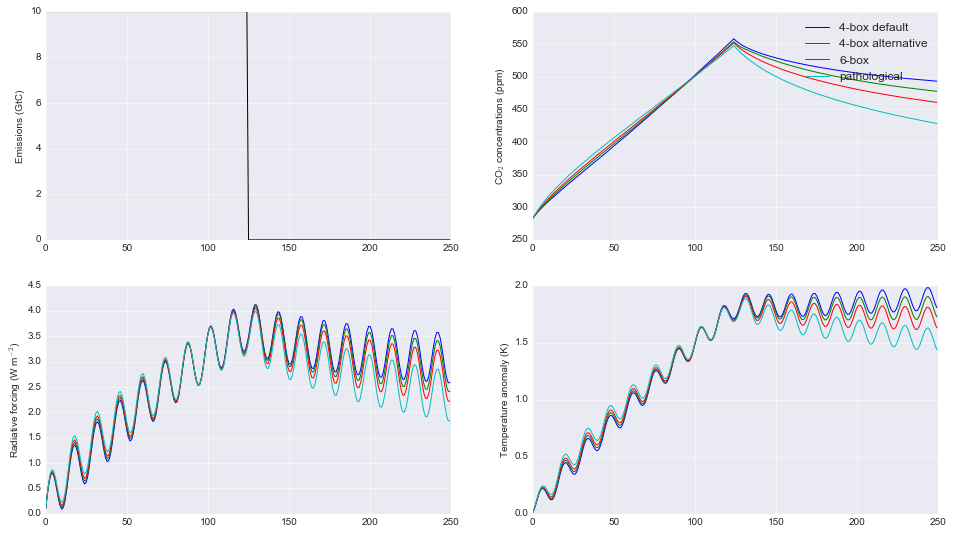

ECS and TCR
~~~~~~~~~~~

The equilibrium climate sensitivity (defined as the equilibrium warming
for an abrupt doubling of CO2 concentrations) and transient climate
response (defined as the temperature change after a CO2 doubling to a 1%
per year compound increase in CO2 concentrations - approximately 70
years) are both key uncertainties in climate science. The temperature
response in FAIR depends on both. The ``tcrecs`` parameter, a 2-element
array, controls this.

This next example shows the effect of varying the ECS and TCR. (Note
that by definition the case ECS=1.0, TCR=1.75 is not possible, but FAIR
can handle such cases anyway).

The biggest effect is on the temperature response, but as the
temperature feeds back into the carbon cycle, this also affects the CO2
concentrations and the radiative forcing.

.. code:: ipython2

    # set up emissions and forcing arrays
    emissions = np.zeros(250)
    emissions[:125] = 10.0
    
    # create output arrays 
    nrun=9
    C = np.empty((emissions.size, nrun))
    F = np.empty((emissions.size, nrun))
    T = np.empty((emissions.size, nrun))
    
    # initialise plot
    fig = plt.figure()
    ax1 = fig.add_subplot(221)
    ax1.plot(range(0, emissions.size), emissions, color='black')
    ax1.set_ylabel('Emissions (GtC)')
    ax2 = fig.add_subplot(222)
    ax3 = fig.add_subplot(223)
    ax4 = fig.add_subplot(224)
    
    ecs = np.array([1.0, 2.0, 3.0, 4.0, 5.0, 3.0, 3.0, 3.0, 3.0])
    tcr = np.array([1.75, 1.75, 1.75, 1.75, 1.75, 0.75, 1.25, 2.25, 2.75])
    colors = ['#800000','#808000','#008000','#008080','#000080', '#000000', '#004000', '#00c000', '#00ff00']
    
    # run the model and plot outputs
    for i in range(nrun):
        C[:,i],F[:,i],T[:,i] = fair.forward.fair_scm(
            emissions=emissions,
            useMultigas=False,
            tcrecs=[tcr[i], ecs[i]],
        )
        
        ax2.plot(range(0, emissions.size), C[:,i], color=colors[i], label='ECS=%3.1fK, TCR=%4.2fK' % (ecs[i], tcr[i]))
        ax2.set_ylabel('CO$_2$ concentrations (ppm)')
        ax3.plot(range(0, emissions.size), F[:,i], color=colors[i])
        ax3.set_ylabel('Radiative forcing (W m$^{-2}$)')
        ax4.plot(range(0, emissions.size), T[:,i], color=colors[i])
        ax4.set_ylabel('Temperature anomaly (K)');
    ax2.legend();

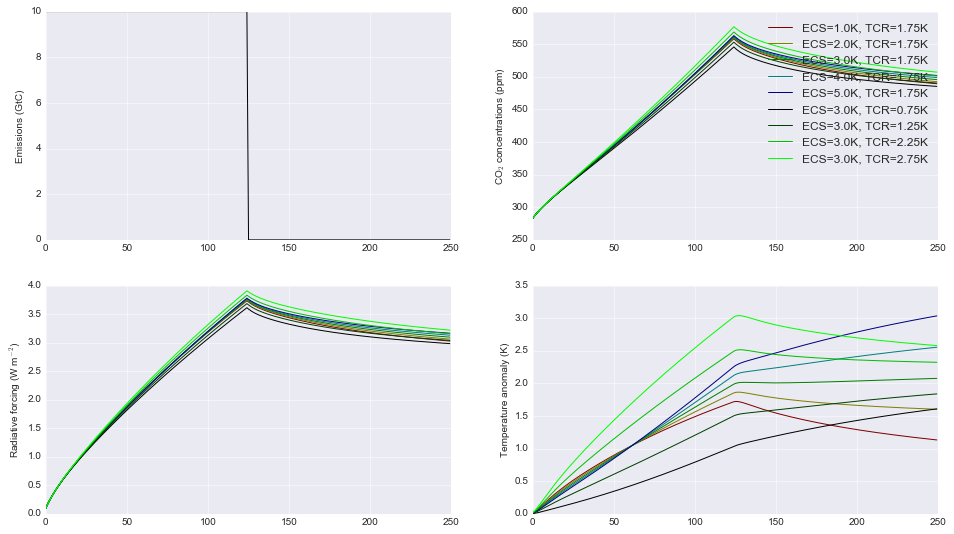

Some recent studies (`Armour
2017 <https://www.nature.com/articles/nclimate3278>`__; `Gregory and
Andrews
2016 <http://onlinelibrary.wiley.com/doi/10.1002/2016GL068406/abstract>`__)
suggest that ECS and TCR may not be constant. Fortunately we can
investigate this in FAIR by specifying ``tcrecs`` as a two dimensional
``(nt, 2)`` array. Notice the effect that a varying ECS/TCR has on the
temperature.

.. code:: ipython2

    from scipy.stats import lognorm, truncnorm
    
    # generate an ECS time series that roughly follows the AR5 likely range
    ecs = lognorm.rvs(0.4, size=250, scale=3, random_state=299)
    
    # define TCR in terms of a realised warming fraction
    rwf = truncnorm.rvs(-3, 3, loc=0.6, scale=0.1, size=250, random_state=301)
    tcr = rwf*ecs
    
    emissions = np.zeros(250)
    emissions[:125] = 10.0
    
    C,F,T = fair.forward.fair_scm(
        emissions=emissions,
        useMultigas=False,
        tcrecs=np.vstack([tcr, ecs]).T,
    )
    
    # plot the output
    fig = plt.figure()
    ax1 = fig.add_subplot(221)
    ax1.plot(range(0, emissions.size), ecs, color='black', label='ECS')
    ax1.plot(range(0, emissions.size), tcr, color='black', ls=':', label='TCR')
    ax1.legend()
    ax1.set_ylabel('ECS/TCR (K)')
    ax2 = fig.add_subplot(222)
    ax2.plot(range(0, emissions.size), C, color='blue')
    ax2.set_ylabel('CO$_2$ concentrations (ppm)')
    ax3 = fig.add_subplot(223)
    ax3.plot(range(0, emissions.size), F, color='orange')
    ax3.set_ylabel('Radiative forcing (W m$^{-2}$)')
    ax4 = fig.add_subplot(224)
    ax4.plot(range(0, emissions.size), T, color='red')
    ax4.set_ylabel('Temperature anomaly (K)');

.. image:: examples_files/examples_16_0.png

The alternative is to specify the values of ``q`` directly (a 2D array)
that go into the temperature calculation, bypassing ``tcrecs``
completely (setting ``tcrecs=None``). It is not known under what
circumstances the user may want to do this, but be assured it's
possible!

.. code:: ipython2

    # set up emissions and forcing arrays
    emissions = np.ones(250) * 10.0
    emissions[125:] = 0.0
    
    q = np.ones((250,2))
    q[:,0] = 0.2
    q[:,1] = 0.6
    C,F,T = fair.forward.fair_scm(
        emissions=emissions,
        useMultigas=False,
        tcrecs=None,
        q=q,
    )
    print (C[-1], F[-1], T[-1])

.. parsed-literal::

    (500.5524349046043, 3.1476987553820677, 2.279051054881353)

Temperature time constants
~~~~~~~~~~~~~~~~~~~~~~~~~~

The slow and fast response of global mean surface temperature is
governed by the two-element array ``d``: this parameter determines the
rate at which radiative forcing is "realised" as a change in surface
temperature.

.. code:: ipython2

    # set up emissions and forcing arrays
    emissions = np.ones(250) * 10.0   # Unit: GtC
    emissions[125:] = 0.0
    other_rf = np.zeros(emissions.size)
    for x in range(0, emissions.size):
        other_rf[x] = 0.5 * np.sin(2 * np.pi * (x) / 14.0)
    
    # create output arrays 
    nrun=4
    C = np.empty((emissions.size, nrun))
    F = np.empty((emissions.size, nrun))
    T = np.empty((emissions.size, nrun))
    
    # run the model for default values
    C[:,0],F[:,0],T[:,0] = fair.forward.fair_scm(
        emissions=emissions,
        other_rf=other_rf,
        useMultigas=False)
    
    # ... and for our alternatives
    C[:,1],F[:,1],T[:,1] = fair.forward.fair_scm(
        emissions=emissions,
        other_rf=other_rf,
        useMultigas=False,
        d=[1000.0, 18.0])
    C[:,2],F[:,2],T[:,2] = fair.forward.fair_scm(
        emissions=emissions,
        other_rf=other_rf,
        useMultigas=False,
        d=[239.0, 1.0])
    C[:,3],F[:,3],T[:,3] = fair.forward.fair_scm(
        emissions=emissions,
        other_rf=other_rf,
        useMultigas=False,
        d=[60., 4.1])
    
    # plot the output
    fig = plt.figure()
    ax1 = fig.add_subplot(221)
    ax1.plot(range(0, emissions.size), emissions, color='black')
    ax1.set_ylabel('Emissions (GtC)')
    ax2 = fig.add_subplot(222)
    handles = ax2.plot(range(0, emissions.size), C)
    labels = ['default','slow repsonse','quick mixed layer response','quick deep ocean response']
    ax2.legend(handles, labels)
    ax2.set_ylabel('CO$_2$ concentrations (ppm)')
    ax3 = fig.add_subplot(223)
    ax3.plot(range(0, emissions.size), F)
    ax3.set_ylabel('Radiative forcing (W m$^{-2}$)')
    ax4 = fig.add_subplot(224)
    ax4.plot(range(0, emissions.size), T)
    ax4.set_ylabel('Temperature anomaly (K)');

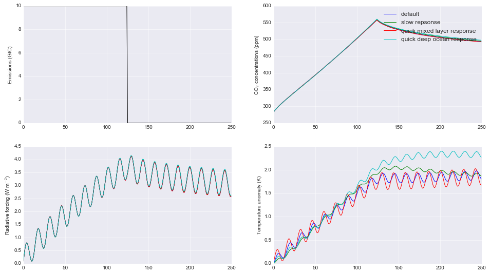

Multi-species mode
------------------

More interesting scenarios can be created with the full suite of forcing
agents. The key changes from CO2-only mode that should be remembered
are:

-  This time the emissions dataset is a (nt, 40) array of inputs
-  ``useMultigas`` should be set to ``True``, or omitted (this is the
   default option)
-  The concentration and forcing outputs are themselves 2-dimensional
   arrays of size (nt, 31) and (nt, 13) respectively
-  More input options to ``fair_scm`` become available.

The basic call to fair\_scm remains the same:

::

    (C,F,T) = fair_scm(emissions=emissions, **kwargs)

Emissions
~~~~~~~~~

In multi-species model, emissions are input as an ``(nt, 40)`` emissions
array. The index order and units of the columns are as follows:

+---------+---------------------+-----------+
| Index   | Species             | Units     |
+=========+=====================+===========+
| 0       | Year                | year      |
+---------+---------------------+-----------+
| 1       | CO2-fossil          | GtC/yr    |
+---------+---------------------+-----------+
| 2       | CO2-landuse         | GtC/yr    |
+---------+---------------------+-----------+
| 3       | CH4                 | Mt/yr     |
+---------+---------------------+-----------+
| 4       | N2O                 | MtN2/yr   |
+---------+---------------------+-----------+
| 5       | SOx                 | MtS/yr    |
+---------+---------------------+-----------+
| 6       | CO                  | Mt/yr     |
+---------+---------------------+-----------+
| 7       | NMVOC               | Mt/yr     |
+---------+---------------------+-----------+
| 8       | NOx                 | MtN/yr    |
+---------+---------------------+-----------+
| 9       | BC                  | Mt/yr     |
+---------+---------------------+-----------+
| 10      | OC                  | Mt/yr     |
+---------+---------------------+-----------+
| 11      | NH3                 | Mt/yr     |
+---------+---------------------+-----------+
| 12      | CF4                 | kt/yr     |
+---------+---------------------+-----------+
| 13      | C2F6                | kt/yr     |
+---------+---------------------+-----------+
| 14      | C6F14               | kt/yr     |
+---------+---------------------+-----------+
| 15      | HFC23               | kt/yr     |
+---------+---------------------+-----------+
| 16      | HFC32               | kt/yr     |
+---------+---------------------+-----------+
| 17      | HFC43-10            | kt/yr     |
+---------+---------------------+-----------+
| 18      | HFC125              | kt/yr     |
+---------+---------------------+-----------+
| 19      | HFC134a             | kt/yr     |
+---------+---------------------+-----------+
| 20      | HFC143a             | kt/yr     |
+---------+---------------------+-----------+
| 21      | HFC227ea            | kt/yr     |
+---------+---------------------+-----------+
| 22      | HFC245fa            | kt/yr     |
+---------+---------------------+-----------+
| 23      | SF6                 | kt/yr     |
+---------+---------------------+-----------+
| 24      | CFC11               | kt/yr     |
+---------+---------------------+-----------+
| 25      | CFC12               | kt/yr     |
+---------+---------------------+-----------+
| 26      | CFC113              | kt/yr     |
+---------+---------------------+-----------+
| 27      | CFC114              | kt/yr     |
+---------+---------------------+-----------+
| 28      | CFC115              | kt/yr     |
+---------+---------------------+-----------+
| 29      | CCl4                | kt/yr     |
+---------+---------------------+-----------+
| 30      | Methyl chloroform   | kt/yr     |
+---------+---------------------+-----------+
| 31      | HCFC22              | kt/yr     |
+---------+---------------------+-----------+
| 32      | HCFC141b            | kt/yr     |
+---------+---------------------+-----------+
| 33      | HCFC142b            | kt/yr     |
+---------+---------------------+-----------+
| 34      | Halon 1211          | kt/yr     |
+---------+---------------------+-----------+
| 35      | Halon 1202          | kt/yr     |
+---------+---------------------+-----------+
| 36      | Halon 1301          | kt/yr     |
+---------+---------------------+-----------+
| 37      | Halon 2401          | kt/yr     |
+---------+---------------------+-----------+
| 38      | CH3Br               | kt/yr     |
+---------+---------------------+-----------+
| 39      | CH3Cl               | kt/yr     |
+---------+---------------------+-----------+

The index order of the columns follows that of the RCP datasets at
http://www.pik-potsdam.de/~mmalte/rcps/.

GHG Concentrations
~~~~~~~~~~~~~~~~~~

Multi-species FAIR tracks the atmospheric concentrations of 31 GHG
species; ``C`` is returned as a ``(nt, 31)`` array. The colums are
indexed as follows:

+---------+---------------------+---------+
| Index   | Species             | Units   |
+=========+=====================+=========+
| 0       | CO2                 | ppm     |
+---------+---------------------+---------+
| 1       | CH4                 | ppb     |
+---------+---------------------+---------+
| 2       | N2O                 | ppb     |
+---------+---------------------+---------+
| 3       | CF4                 | ppt     |
+---------+---------------------+---------+
| 4       | C2F6                | ppt     |
+---------+---------------------+---------+
| 5       | C6F14               | ppt     |
+---------+---------------------+---------+
| 6       | HFC23               | ppt     |
+---------+---------------------+---------+
| 7       | HFC32               | ppt     |
+---------+---------------------+---------+
| 8       | HFC43-10            | ppt     |
+---------+---------------------+---------+
| 9       | HFC125              | ppt     |
+---------+---------------------+---------+
| 10      | HFC134a             | ppt     |
+---------+---------------------+---------+
| 11      | HFC143a             | ppt     |
+---------+---------------------+---------+
| 12      | HFC227ea            | ppt     |
+---------+---------------------+---------+
| 13      | HFC245fa            | ppt     |
+---------+---------------------+---------+
| 14      | SF6                 | ppt     |
+---------+---------------------+---------+
| 15      | CFC11               | ppt     |
+---------+---------------------+---------+
| 16      | CFC12               | ppt     |
+---------+---------------------+---------+
| 17      | CFC113              | ppt     |
+---------+---------------------+---------+
| 18      | CFC114              | ppt     |
+---------+---------------------+---------+
| 19      | CFC115              | ppt     |
+---------+---------------------+---------+
| 20      | CCl4                | ppt     |
+---------+---------------------+---------+
| 21      | Methyl chloroform   | ppt     |
+---------+---------------------+---------+
| 22      | HCFC22              | ppt     |
+---------+---------------------+---------+
| 23      | HCFC141b            | ppt     |
+---------+---------------------+---------+
| 24      | HCFC142b            | ppt     |
+---------+---------------------+---------+
| 25      | Halon 1211          | ppt     |
+---------+---------------------+---------+
| 26      | Halon 1202          | ppt     |
+---------+---------------------+---------+
| 27      | Halon 1301          | ppt     |
+---------+---------------------+---------+
| 28      | Halon 2401          | ppt     |
+---------+---------------------+---------+
| 29      | CH3Br               | ppt     |
+---------+---------------------+---------+
| 30      | CH3Cl               | ppt     |
+---------+---------------------+---------+

Effective radiative forcing
~~~~~~~~~~~~~~~~~~~~~~~~~~~

Finally, a ``(nt, 13)`` array ``F`` of effective radiative forcing is
returned (all units W m-2):

+---------+-------------------------------------------------+
| Index   | Species                                         |
+=========+=================================================+
| 0       | CO2                                             |
+---------+-------------------------------------------------+
| 1       | CH4                                             |
+---------+-------------------------------------------------+
| 2       | N2O                                             |
+---------+-------------------------------------------------+
| 3       | All other well-mixed GHGs                       |
+---------+-------------------------------------------------+
| 4       | Tropospheric O3                                 |
+---------+-------------------------------------------------+
| 5       | Stratospheric O3                                |
+---------+-------------------------------------------------+
| 6       | Stratospheric water vapour from CH4 oxidation   |
+---------+-------------------------------------------------+
| 7       | Contrails                                       |
+---------+-------------------------------------------------+
| 8       | Aerosols                                        |
+---------+-------------------------------------------------+
| 9       | Black carbon on snow                            |
+---------+-------------------------------------------------+
| 10      | Land use change                                 |
+---------+-------------------------------------------------+
| 11      | Volcanic                                        |
+---------+-------------------------------------------------+
| 12      | Solar                                           |
+---------+-------------------------------------------------+

With the exception of volcanic and solar, all forcing outputs are
calculated from the input emissions.

A multi-gas example
-------------------

This sets up a multi-gas emissions array and serves to demonstrate some
of the options that can be specified in ``fair_scm`` for multi-gas runs
(most are changed from the default and some are non-sensical but shown
for illustration). Note this is a completely hypothetical scenario!

.. code:: ipython2

    from scipy.stats import gamma
    emissions = np.zeros((250,40))
    
    # remember column zero is the years
    emissions[:,0] = np.arange(1850,2100)
    
    # add some CO2 fossil and land use, GtC/yr
    emissions[:,1] = 10.
    emissions[:,2] = 1.
    
    # some methane and nitrous oxide in this example, Mt/yr
    emissions[:,3] = 300.
    emissions[:,4] = 19.
    
    # aerosol and ozone precursors, Mt/yr
    emissions[:,5] = 0.1*np.arange(250)   # SOx
    emissions[:,6] = 500.*np.log(1+np.arange(250))  # CO
    emissions[:,7] = 100.+100.*np.cos(np.arange(250))  # NMVOC
    emissions[:,8] = 40.*norm.rvs(loc=1, scale=0.1, size=250, random_state=9)   # NOx
    emissions[:,9] = 6.    # BC
    emissions[:,10] = 30.  # OC
    emissions[:,11] = 35.  # NH3
    
    # throw in some CFCs
    emissions[:,24] = 1000. # CFC11
    # and leave all other emissions as zero.
    
    # Volcanic and solar forcing are provided externally. Let's invent some
    solar = 0.1 * np.sin(2 * np.pi * np.arange(250) / 11.5)
    volcanic = -gamma.rvs(0.2, size=250, random_state=100)
    
    # efficacies are the temperature change for each forcing agent compared to CO2
    # in our runs we usually set the efficacy of BC on snow to 3, following Bond et
    # al (2013)
    eff = np.ones(13)
    eff[9] = 3.0
    
    # b_aero: ERFari for each SLCF species (indices 5 to 11)
    # b_tro3: tropospheric ozone coeffs for CH4, CO, NMVOC, NOx
    C,F,T = fair_scm(emissions=emissions,
                     natural=np.zeros((250,2)), # natural emissions of CH4 and N2O
                     aviNOx_frac=0.05, # proportion of NOx emissions from aviation
                     fossilCH4_frac=0.25, # proportion of anthro CH4 emis from fossil fuels
                     oxCH4_frac=0.61, # proportion of fossil CH4 eventually oxidised to CO2
                     stwv_from_ch4=0.1, # proportion of CH4 ERF contributing to strat H2O
                     ghg_forcing='Etminan',  # etminan or myhre
                     useStevenson=False, # Stevenson or regression based trop. O3 forcing?
                     b_aero = np.array([-35,0,-5,-6,450,-40,-10])*1e-4,
                     b_tro3 = np.array([3., 1., 8., 99.])*1e-4,
                     aerosol_forcing = 'aerocom+ghan',  # aerocom, aerocom+ghan or stevens
                     F_solar = solar,
                     F_volcanic = volcanic,
                     efficacy = eff
                    )
    
    # Plot the forcing from each component
    fig = plt.figure()
    label = ['CO2','CH4','N2O','Other GHG','Trop O3','Strat O3','Strat H2O','Contrails','Aerosols',
             'BC on snow', 'Land use', 'Volcanic', 'Solar']
    for i in range(13):
        ax = fig.add_subplot(5,3,i+1)
        ax.plot(np.arange(1850,2100), F[:,i])
        ax.text(0.95,0.95,label[i],transform=ax.transAxes,va='top', ha='right')
    # plot temperature change
    ax = fig.add_subplot(5,3,15)
    ax.plot(np.arange(1850,2100),T)
    ax.text(0.95, 0, 'Temperature change', transform=ax.transAxes, va='bottom', ha='right')

.. parsed-literal::

    Text(0.95,0,u'Temperature change')

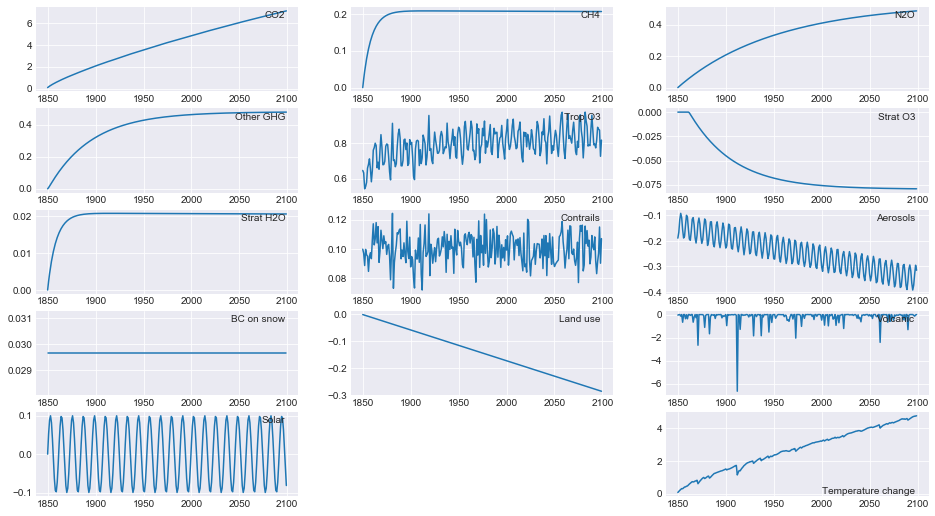

RCP scenarios
-------------

Creating a 40-column emissions input table may seem a lot of work. FAIR
comes with tools to make your life easier!

We can run FAIR with the CO2 emissions and non-CO2 forcing from the four
representative concentration pathway scenarios. These can be imported
from the ``RCPs`` module and have inbuilt ``Forcing`` and ``Emissions``
classes. There is also a tool for converting MAGICC6 \*.SCEN files into
FAIR input (in ``fair/tools/magicc``).

Here we show the FAIR implementation of the RCP scenarios. Following
Meinshausen's convention RCP3PD is an alias for RCP2.6.

.. code:: ipython2

    # Get RCP modules
    from fair.RCPs import rcp3pd, rcp45, rcp6, rcp85
    
    # Basic RCP runs
    C26, F26, T26 = fair.forward.fair_scm(emissions=rcp3pd.Emissions.emissions)
    C45, F45, T45 = fair.forward.fair_scm(emissions=rcp45.Emissions.emissions)
    C60, F60, T60 = fair.forward.fair_scm(emissions=rcp6.Emissions.emissions)
    C85, F85, T85 = fair.forward.fair_scm(emissions=rcp85.Emissions.emissions)
    
    fig = plt.figure()
    ax1 = fig.add_subplot(221)
    ax2 = fig.add_subplot(222)
    ax3 = fig.add_subplot(223)
    ax4 = fig.add_subplot(224)
    
    ax1.plot(rcp3pd.Emissions.year, rcp3pd.Emissions.co2_fossil, color='green', label='RCP2.6')
    # just show CO2 conc.
    ax2.plot(rcp3pd.Emissions.year, C26[:, 0], color='green')
    # sum over axis 1 to get total ERF
    ax3.plot(rcp3pd.Emissions.year, np.sum(F26, axis=1), color='green')
    ax4.plot(rcp3pd.Emissions.year, T26, color='green')
    
    ax1.plot(rcp45.Emissions.year, rcp45.Emissions.co2_fossil, color='blue', label='RCP4.5')
    ax2.plot(rcp45.Emissions.year, C45[:, 0], color='blue')
    ax3.plot(rcp45.Emissions.year, np.sum(F45, axis=1), color='blue')
    ax4.plot(rcp45.Emissions.year, T45, color='blue')
    
    ax1.plot(rcp6.Emissions.year, rcp6.Emissions.co2_fossil, color='red', label='RCP6')
    ax2.plot(rcp6.Emissions.year, C60[:, 0], color='red')
    ax3.plot(rcp6.Emissions.year, np.sum(F60, axis=1), color='red')
    ax4.plot(rcp6.Emissions.year, T60, color='red')
    
    ax1.plot(rcp85.Emissions.year, rcp85.Emissions.co2_fossil, color='black', label='RCP8.5')
    ax2.plot(rcp85.Emissions.year, C85[:, 0], color='black')
    ax3.plot(rcp85.Emissions.year, np.sum(F85, axis=1), color='black')
    ax4.plot(rcp85.Emissions.year, T85, color='black')
    
    ax1.set_ylabel('Fossil CO$_2$ Emissions (GtC)')
    ax1.legend()
    ax2.set_ylabel('CO$_2$ concentrations (ppm)')
    ax3.set_ylabel('Total radiative forcing (W m$^{-2}$)')
    ax4.set_ylabel('Temperature anomaly (K)');

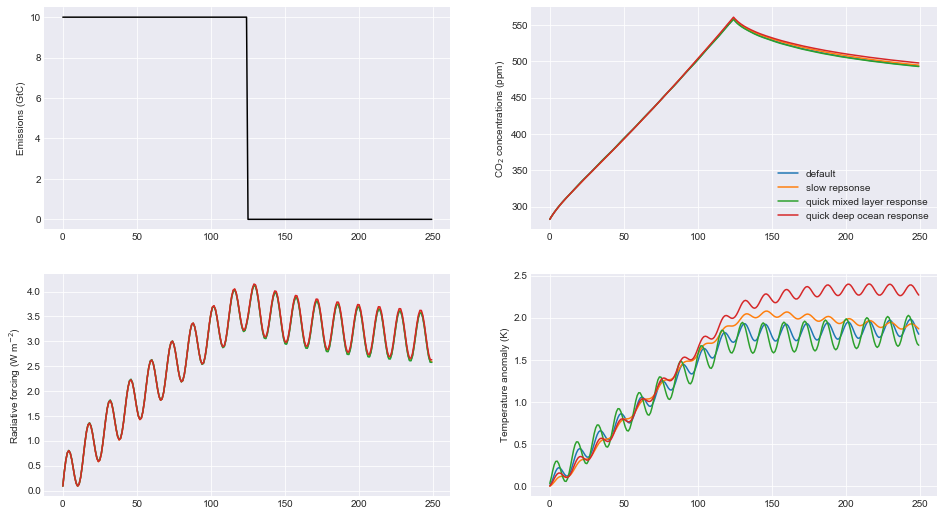

Concentrations of well-mixed greenhouse gases
---------------------------------------------

In this example we also show how to group minor gases into CFC12 and
HFC134a equivalent concentrations. Refer to table above for gas indices.

.. code:: ipython2

    fig = plt.figure()
    ax1 = fig.add_subplot(221)
    ax2 = fig.add_subplot(222)
    ax3 = fig.add_subplot(223)
    ax4 = fig.add_subplot(224)
    
    ax1.plot(rcp3pd.Emissions.year, C26[:,1], color='green', label='RCP3PD')
    ax1.plot(rcp45.Emissions.year, C45[:,1], color='blue', label='RCP4.5')
    ax1.plot(rcp6.Emissions.year, C60[:,1], color='red', label='RCP6')
    ax1.plot(rcp85.Emissions.year, C85[:,1], color='black', label='RCP8.5')
    ax1.set_title("Methane concentrations, ppb")
    
    ax2.plot(rcp3pd.Emissions.year, C26[:,2], color='green', label='RCP3PD')
    ax2.plot(rcp45.Emissions.year, C45[:,2], color='blue', label='RCP4.5')
    ax2.plot(rcp6.Emissions.year, C60[:,2], color='red', label='RCP6')
    ax2.plot(rcp85.Emissions.year, C85[:,2], color='black', label='RCP8.5')
    ax2.set_title("Nitrous oxide concentrations, ppb")
    
    # Weight H and F gases by radiative efficiency
    from fair.constants import radeff
    
    # indices 3:15 are HFCs and PFCs
    C26_hfc134a_eq = np.sum(C26[:,3:15]*radeff.aslist[3:15],axis=1)/radeff.HFC134A   
    C45_hfc134a_eq = np.sum(C45[:,3:15]*radeff.aslist[3:15],axis=1)/radeff.HFC134A
    C60_hfc134a_eq = np.sum(C60[:,3:15]*radeff.aslist[3:15],axis=1)/radeff.HFC134A
    C85_hfc134a_eq = np.sum(C85[:,3:15]*radeff.aslist[3:15],axis=1)/radeff.HFC134A
    
    # indices 15:31 are ozone depleters
    C26_cfc12_eq = np.sum(C26[:,15:31]*radeff.aslist[15:31],axis=1)/radeff.CFC12  
    C45_cfc12_eq = np.sum(C45[:,15:31]*radeff.aslist[15:31],axis=1)/radeff.CFC12
    C60_cfc12_eq = np.sum(C60[:,15:31]*radeff.aslist[15:31],axis=1)/radeff.CFC12
    C85_cfc12_eq = np.sum(C85[:,15:31]*radeff.aslist[15:31],axis=1)/radeff.CFC12
    
    ax3.plot(rcp3pd.Emissions.year, C26_hfc134a_eq, color='green', label='RCP2.6')
    ax3.plot(rcp45.Emissions.year, C45_hfc134a_eq, color='blue', label='RCP4.5')
    ax3.plot(rcp6.Emissions.year, C60_hfc134a_eq, color='red', label='RCP6')
    ax3.plot(rcp85.Emissions.year, C85_hfc134a_eq, color='black', label='RCP8.5')
    ax3.set_title("HFC134a equivalent concentrations, ppt")
    
    ax4.plot(rcp3pd.Emissions.year, C26_cfc12_eq, color='green', label='RCP2.6')
    ax4.plot(rcp45.Emissions.year, C45_cfc12_eq, color='blue', label='RCP4.5')
    ax4.plot(rcp6.Emissions.year, C60_cfc12_eq, color='red', label='RCP6')
    ax4.plot(rcp85.Emissions.year, C85_cfc12_eq, color='black', label='RCP8.5')
    ax4.set_title("CFC12 equivalent concentrations, ppt")
    ax1.legend();

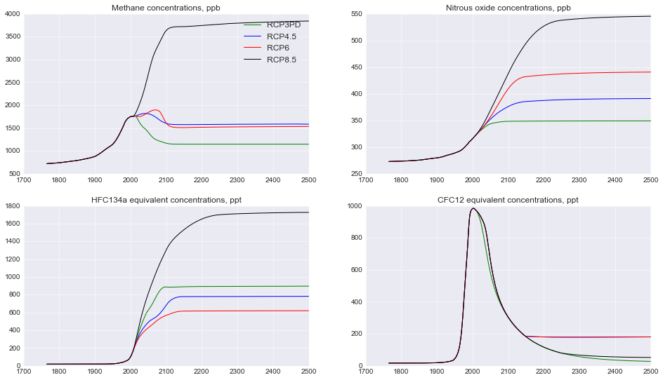

Radiative forcing
-----------------

Here we show some of the more interesting examples for the effective
radiative forcing time series coming out of FAIR.

.. code:: ipython2

    fig = plt.figure()
    ax1 = fig.add_subplot(221)
    ax2 = fig.add_subplot(222)
    ax3 = fig.add_subplot(223)
    ax4 = fig.add_subplot(224)
    
    ax1.plot(rcp3pd.Emissions.year, F26[:,4], color='green', label='RCP2.6')
    ax1.plot(rcp45.Emissions.year, F45[:,4], color='blue', label='RCP4.5')
    ax1.plot(rcp6.Emissions.year, F60[:,4], color='red', label='RCP6')
    ax1.plot(rcp85.Emissions.year, F85[:,4], color='black', label='RCP8.5')
    ax1.set_title("Tropospheric ozone forcing, W m$^{-2}$")
    
    ax2.plot(rcp3pd.Emissions.year, F26[:,5], color='green', label='RCP2.6')
    ax2.plot(rcp45.Emissions.year, F45[:,5], color='blue', label='RCP4.5')
    ax2.plot(rcp6.Emissions.year, F60[:,5], color='red', label='RCP6')
    ax2.plot(rcp85.Emissions.year, F85[:,5], color='black', label='RCP8.5')
    ax2.set_title("Stratospheric ozone forcing, W m$^{-2}$")
    
    ax3.plot(rcp3pd.Emissions.year, F26[:,8], color='green', label='RCP2.6')
    ax3.plot(rcp45.Emissions.year, F45[:,8], color='blue', label='RCP4.5')
    ax3.plot(rcp6.Emissions.year, F60[:,8], color='red', label='RCP6')
    ax3.plot(rcp85.Emissions.year, F85[:,8], color='black', label='RCP8.5')
    ax3.set_title("Aerosol forcing, W m$^{-2}$")
    
    ax4.plot(rcp3pd.Emissions.year, F26[:,10], color='green', label='RCP2.6')
    ax4.plot(rcp45.Emissions.year, F45[:,10], color='blue', label='RCP4.5')
    ax4.plot(rcp6.Emissions.year, F60[:,10], color='red', label='RCP6')
    ax4.plot(rcp85.Emissions.year, F85[:,10], color='black', label='RCP8.5')
    ax4.set_title("Land use forcing, W m$^{-2}$")
    ax1.legend();

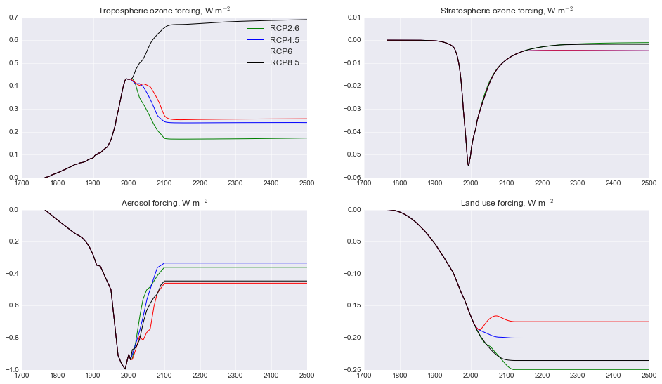

Natural emissions and GHG lifetimes
-----------------------------------

In order to balance historical concentrations of methane and nitrous
oxide, we assume a time-varying profile of natural emissions. This can
be varied with the ``natural`` keyword (a ``(nt, 2)`` array of methane
and nitrous oxide emissions). Additionally, the default greenhouse gas
decay constants can be modified with the ``lifetimes`` keyword (shape
``(31,)``).

It can clearly be seen that natural emissions are important in
maintaining historical concentrations.

.. code:: ipython2

    # Change default lifetimes of CH4 and N2O
    from fair.constants import lifetime
    lt = lifetime.aslist
    lt[1] = 12.6
    lt[2] = 131.
    
    # what are the defaults?
    print (lifetime.CH4, lifetime.N2O)
    
    # How long are the RCPs?
    nt = len(rcp45.Emissions.year)
    
    # Run FAIR under RCP4.5 with no natural emissions
    C1,F1,T1 = fair_scm(emissions=rcp45.Emissions.emissions,
                        natural=np.zeros((nt,2))
                        )
    
    # Run FAIR under RCP4.5 with modified lifetimes
    C2,F2,T2 = fair_scm(emissions=rcp45.Emissions.emissions,
                        lifetimes=lt
                        )
    
    fig = plt.figure()
    ax1 = fig.add_subplot(221)
    ax2 = fig.add_subplot(222)
    
    ax1.plot(rcp45.Emissions.year, C45[:,1], color='blue', label='RCP4.5 default')
    ax1.plot(rcp45.Emissions.year, C1[:,1], color='blue', ls=':', label='RCP4.5 no natural')
    ax1.plot(rcp45.Emissions.year, C2[:,1], color='blue', ls='--', label='RCP4.5 modified lifetime')
    ax1.set_title("Methane concentrations, ppb")
    ax2.plot(rcp45.Emissions.year, C45[:,2], color='blue', label='RCP4.5')
    ax2.plot(rcp45.Emissions.year, C1[:,2], color='blue', ls=':', label='RCP4.5 no natural')
    ax2.plot(rcp45.Emissions.year, C2[:,2], color='blue', ls='--', label='RCP4.5 modified lifetime')
    ax2.set_title("Nitrous oxide concentrations, ppb")
    ax1.legend();

.. parsed-literal::

    (9.3, 121.0)

.. image:: examples_files/examples_31_1.png

Ensemble generation
-------------------

An advantage of FAIR is that it is very quick to run (much less than a
second on an average machine). Therefore it can be used to generate
probabilistic future ensembles. We'll show a 100-member ensemble.

This example also introduces the ``scale`` and ``F2x`` keywords.
``scale`` (a 13 element array) governs the forcing scaling factor of
each of the 13 categories of forcing, whereas ``F2x`` determines the ERF
from a doubling of CO2.

.. code:: ipython2

    from scipy import stats
    
    # generate some (bad) TCR and ECS pairs
    tcrecs = stats.norm.rvs(size=(100,2), loc=[1.75,3], scale=[0.4,0.8], random_state=38571)
    
    # generate some forcing scale factors with SD of 10% of the best estimate
    F_scale = stats.norm.rvs(size=(100,13), loc=1, scale=0.1, random_state=40000)
    F2x = 3.71 * F_scale[:,0]
    F_scale[:,0] = 1.0  # set CO2 forcing scaling with F2x above
    
    # generate ensemble for carbon cycle parameters
    r0 = stats.norm.rvs(size=100, loc=35, scale=3.5, random_state=41000)
    rc = stats.norm.rvs(size=100, loc=0.019, scale=0.0019, random_state=42000)
    rt = stats.norm.rvs(size=100, loc=4.165, scale=0.4165, random_state=45000)
    
    T = np.zeros((nt,100))
    
    # notice that we
    for i in range(100):
        _, _, T[:,i] = fair_scm(emissions=rcp85.Emissions.emissions,
                                r0 = r0[i],
                                rc = rc[i],
                                rt = rt[i],
                                tcrecs = tcrecs[i,:],
                                scale = F_scale[i,:],
                                F2x = F2x[i]
                               )

.. code:: ipython2

    fig = plt.figure()
    ax1 = fig.add_subplot(111)
    ax1.plot(rcp85.Emissions.year, T);

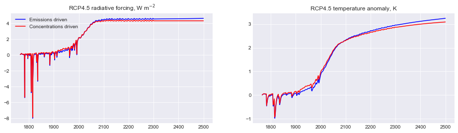

Adding a temperature constraint
~~~~~~~~~~~~~~~~~~~~~~~~~~~~~~~

The resulting projections show a large spread. Some of these ensemble
members are unrealistic, ranging from around 0.4 to 2.0 K temperature
change in the present day, whereas we know in reality it is more like
0.95 (plus or minus 0.2). Therefore we can constrain this ensemble to
observations.

.. code:: ipython2

    from fair.tools.constrain import hist_temp
    
    # Cowtan & Way in-filled dataset of global temperatures
    CW = np.loadtxt('../fair/tools/tempobs/had4_krig_annual_v2_0_0.csv')
    constrained = np.zeros(100, dtype=bool)
    for i in range(100):
        # we use observed trend from 1880 to 2016
        constrained[i],_,_,_,_ = hist_temp(
            CW[30:,1], T[1880-1765:2017-1765,i], CW[30:,0])

.. code:: ipython2

    # How many ensemble members passed the constraint?
    print np.sum(constrained)

.. parsed-literal::

    28

.. code:: ipython2

    # What does this do to the ensemble?
    fig = plt.figure()
    ax1 = fig.add_subplot(111)
    ax1.plot(rcp85.Emissions.year, T[:,constrained]);

.. image:: examples_files/examples_38_0.png

Some, but not all, of the higher end scenarios have been constrained
out, but there is still quite a large range of total temperature change
projected for 2500 even under this constraint.

From these constraints it is possible to obtain posterior distributions
on effective radiative forcing, ECS, TCR, TCRE and other metrics.

