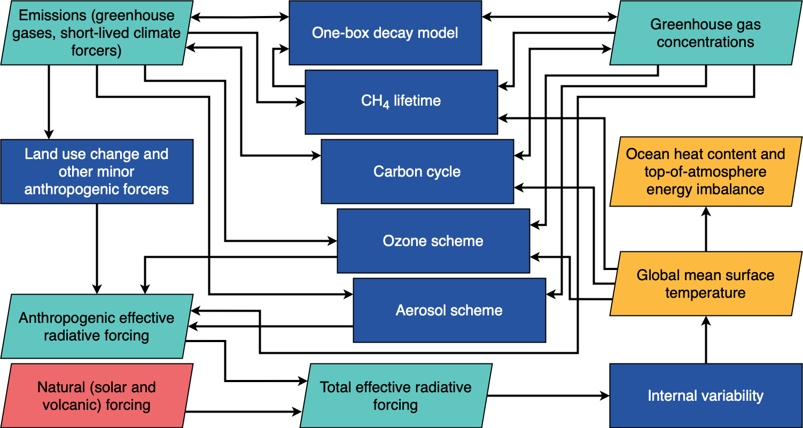

FaIR: Finite Amplitude Impulse Response simple climate model
============================================================

FaIR is a reduced-complexity climate model.

FaIR produces global mean temperature projections from various forcers. Input datasets can be provided in terms of emissions, concentrations (for greenhouse gases) or effective radiative forcing. Species can be mixed and matched (e.g. if you want to provide CO:sub:`2` and short-lived climate forcer emissions, with concentrations of non-CO:sub:`2` greenhouse gases and prescribed forcing for volcanic and solar forcing, like the esm-hist runs of CMIP6 Earth System Models).

  Simplified outline of available processes in FaIR. Some processes have been omitted for clarity.

Contents
========

.. toctree::
   :maxdepth: 1

   install
   examples
   api_reference

Indices and tables
==================

* :ref:`genindex`
* :ref:`modindex`
* :ref:`search`
