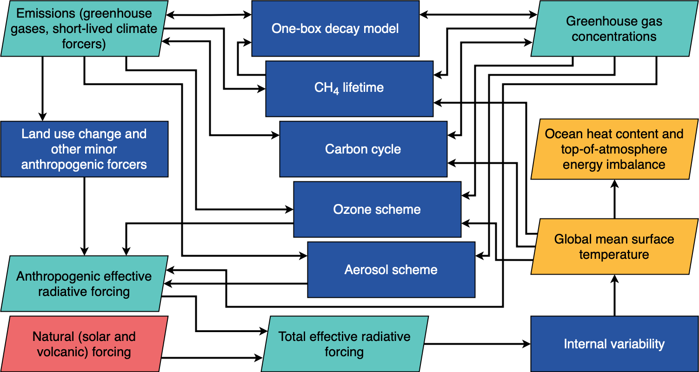
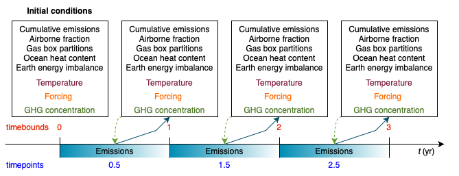
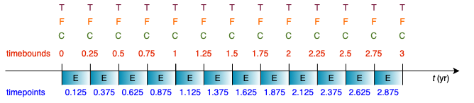

Introduction
============

This introduction addresses some of the key concepts of FaIR and how they are now
implemented inside the model. For worked examples of FaIR and the energy balance
model, take a look at the :doc:`examples`.

FaIR produces global mean temperature projections from various forcers. Input datasets
can be provided in terms of emissions, concentrations (for greenhouse gases), or
effective radiative forcing. Different species can be input in different ways,
if they are internally consistent and valid (e.g. if you want to provide CO\ :sub:`2`
and short-lived climate forcer emissions, with concentrations of non-CO\ :sub:`2`
greenhouse gases and prescribed forcing for volcanic and solar forcing, like the
*esm-hist* runs of CMIP6 Earth System Models). You can provide any number of species
from single-forcing runs to full climate assessments. In "full-climate" mode, the
process diagram in FaIR is similar to :numref:`process`.

.. _process:

  Simplified outline of available processes in FaIR. Some processes have been omitted for clarity.

FaIR is now a primarily object-oriented interface. The main interaction with FaIR is
through the ``FAIR`` class instance::

    from fair import FAIR
    f = FAIR()

``FAIR()`` contains the attributes and methods required to run the model. The energy
balance climate model can also be run in standalone mode with prescribed forcing.
In the rest of this introduction, ``f`` is taken to be a ``FAIR`` instance.

Typically there are two stages to a FaIR run. The first is to set up the dimensionality of
the problem (define time horizon, included species and how to implement them), and the
second is to fill in the data and do the run.

Dimensionality
--------------

Internally, variables in are book-kept with ``numpy`` arrays that have up to five
dimensions:

Not all variables include all dimensions, but they are always in this order.

Parallelisation allows more than one ``scenario`` and one set of ``configs`` to be run
at the same time. ``time`` is the only axis which is looped over,
allowing high efficiency multiple-scenario or multiple-configuration runs to be done
on the same processor (subject to available RAM and disk space).

For inputs and outputs, we use ``xarray``, which wraps the ``numpy`` arrays with axis labels
and makes model input and output a little more tractable.

Defining the dimensionality of the problem is the first step of setting up FaIR.

Time
~~~~

FaIR uses two time variables to keep track of state variables: ``timepoints`` and
``timebounds``. Only emissions are defined on ``timepoints``, where everything else
is on ``timebounds``. As the name suggests, ``timebounds`` are on the boundary of model
time steps, and ``timepoints`` are nominally at the centre of the model time step.
:numref:`timestepping` illustrates this.

.. _timestepping:

  Timebounds (red) and timepoints (blue) in FaIR, showing associated state variables
  defined on each time variable. FaIR can be run with prescibed emissions (blue arrows)
  and/or with prescribed concentrations for greenhouse gases (green arrows).

Time is specified in years, but you are not forced to use integer years. This can be
useful for coupling directly with integrated assessment model derived emissions (often
5- or 10-year timesteps) or assessing short-term responses to volcanic forcing, where
sub-annual responses can be important. :numref:`timestepping_qtr` shows the timestepping for
a :math:`1/4`-year timestep.

.. _timestepping_qtr:

  Timebounds (red) and timepoints (blue) in FaIR using a quarter-year time step.

A FaIR ecosystem therefore contains :math:`n/{\delta t}` ``timepoints`` and
:math:`n/{\delta t} + 1` ``timebounds`` where :math:`{\delta t}` is the timestep and
:math:`n` is the number of years.

Time is defined as so::

    f.define_time(start, end, timestep)

You can label time how you wish. Common runs for climate projections will start with
a pre-industrial reference year (maybe 1750 or 1850), and run to 2100 or beyond::

    f.define_time(1750, 2100, 1)

Or you might want to run an idealised pulse experiment, in which case it's
less informative to assign real years and it is better to start at zero::

    f.define_time(0, 1000, 1)

The simple non-integer example from :numref:`timestepping_qtr` would thus be::

    f.define_time(0, 3, 0.25)

We adopt the ``pandas`` practice of including the end point.

For intepreting real dates, the
``timebound`` 1750 refers to 00:00 on 1 January 1750, and the ``timepoint`` 1750.5 is
a mid-year average of the period 00:00 on 1 January 1750 to 00:00 on 1 January 1751.
FaIR makes no adjustments for leap years or month length, and assumes each year is
365.24219 days long. The temporal difference between ``timebound`` and ``timepoint``
can be important when interpreting and reporting results: does temperature in 2100 mean
at the ``timebound`` 2100, or do we want a mid-year average (corresponding to ``timepoint``
2100.5, in which case we might want to interpolate or take an average of the 2100
and 2101 ``timebounds``.)

Scenarios
~~~~~~~~~

A ``scenario`` is a set of emissions/concentration/forcing inputs and climate responses.
Multiple ``scenarios`` can be run in parallel. They are defined as a list of names, for example::

    f.define_scenarios(['ssp126', 'ssp245', 'ssp370'])

Note at this stage we are only defining names: no data is being input into FaIR.

Configs
~~~~~~~

A ``config`` defines a set of climate and species parameters to run FaIR with. For
example, we might want to run with emulations of a few CMIP6 models, which have
different climate sensitivities, aerosol forcing sensitivities to precurors, carbon
cycle feedback strengths, and so on::

    f.define_configs(['UKESM', 'NorESM', 'GFDL', 'MIROC'])

Again, we are only defining names at this stage.

Combined with the three ``scenarios`` above, we have a matrix of 12 runs:
each of three emissions scenarios will be run with each of four climate configs.

Species
~~~~~~~

A ``specie`` is anything that forces climate or other species in FaIR, which is a broad
definition. This includes greenhouse gases, aerosol precurors, ozone precursors as
expected, but also forcing categories (aerosol-radiation interactions, ozone forcing,
land-use forcing) that may be calculated from other species.

Each ``specie`` has an associated dict of ``properties`` which defines how it is
implemented in the particular run of FaIR and how it behaves. A ``properties`` dict for
a CO\ :sub:`2` run might look like::

    properties = {
        'CO2': {
            'type': 'co2',
            'input_mode': 'emissions',
            'greenhouse_gas': True,
            'aerosol_chemistry_from_emissions': False,
            'aerosol_chemistry_from_concentration': False,
        }
    }

The five dict keys of ``type``, ``input_mode``, ``greenhouse_gas``,
``aerosol_chemistry_from_emissions`` and ``aerosol_chemistry_from_concentration``
are all required. Both ``type`` and ``input_mode`` are from pre-defined lists. The API
reference for `fair.FAIR.define_species <api_reference.html#fair.FAIR.define_species>`_ explains more.

Species are then declared in FaIR with::

    f.define_species(['CO2'], properties)

Basic checks are performed to ensure that input specifications make sense (e.g. you
cannot run a type ``solar`` in ``emissions`` mode, and many species types must be
unique). An error will be raised if an invalid combination of options is provided.

For all but single-forcing experiments, defining ``species`` this way could be quite onerous.
To grab an emissions-driven run using all ``species`` known to FaIR with their
default values, use::

    species, properties = read_properties()
    f.define_species(species, properties)

Box and layer
~~~~~~~~~~~~~

FaIR uses a multiple-box atmospheric decay model with lifetime scaling for greenhouse
gases (see e.g. [Millar2017]_). This is represented by the ``box`` dimension.
By default, there are 4 boxes, but this can be modified in the initialisation::

    f = FAIR(n_gasboxes=3)

or by accessing the attribute directly after initialisation::

    f.n_gasboxes=3

``layer`` refers to the ocean layer of the energy balance model.
By default, FaIR uses 3 layers, though this can be modified in the initialisation of the
class::

    f = FAIR(n_layers=2)

or by accessing the attribute directly:

    f.n_layers=3

State variables
---------------

State variables are attributes of the ``FAIR`` class. All state variables are outputs, and many are valid inputs (particularly for the
first ``timebound`` in which many must be provided with an initial condition).

After problem setup (see ref:`Dimensionality`), these ``xarrays`` will be created inside
FaIR with::

    f.allocate()

Dimensions with invalid combinations are retained in the output (e.g. ``f.emissions``
will be ``np.nan`` for solar forcing) to maintain alignment between datasets.

Emissions
~~~~~~~~~

Emissions are the only variable defined on ``timepoints``, and are quantified as an
emissions rate per year. FaIR will automatically adjust the emissions flows if a non-
annual timestep is provided. Emissions are input or output as the ``emissions``
attribute of ``FAIR``::

    f.emissions :: [timepoint, scenario, config, specie]

Concentrations
~~~~~~~~~~~~~~

For greenhouse gases, concentrations can be input, or calculated::

    f.concentration :: [timebound, scenario, config, specie]

Note the FaIR variable name is ``concentration``, in the singular.

When running in emissions mode, the initial concentration of a greenhouse gas should
be specified (at ``timebound`` 0). We provide a convenience function, ``initialise()``,
for specifying initial conditions::

    from fair import initialise
    initialise(f.concentration, 278.3, specie='CO2')

You could also directly modify the ``f.concentration`` ``xarray`` by label::

    f.concentration.loc[dict(timebound=1750, specie='CO2')] = 278.3

or position, if you know that CO\ :sub:`2` is index 0 of the `specie` axis::

    f.concentration[0, :, :, 0] = 278.3

Effective radiative forcing
~~~~~~~~~~~~~~~~~~~~~~~~~~~

At the per-species level, effective radiative forcing can be input or calculated::

    f.forcing :: [timebound, scenario, config, specie]

We use the shorter name ``forcing``, which should be taken to represent effective
radiative forcing.

For some species like solar and volcanic, specifying forcing is the only valid input mode.

Again, initial forcing must be provided. In many cases, this will be zero for every
species, in which case we don't have to specify it for each ``specie``::

    initialise(f.forcing, 0)

The total effective radiative forcing is an output only::

    f.forcing_sum :: [timebound, scenario, config]

and is simply ``forcing`` summed over the ``specie`` axis.

Units are W m\ :sup:`-2`.

Temperature
~~~~~~~~~~~

Temperatures in FaIR are expressed as anomalies (in units of Kelvin) relative to some reference state, usually
pre-industrial. Temperature is calculated from an :math:`n`-layer ocean energy balance
model::

    f.temperature :: [timebound, scenario, config, layer]

The temperature near the surface and hence of most importance is layer 0. Again, initial
conditions of temperature in all layers should be provided, and for a "cold-start" model
can be done with::

    initialise(f.temperature, 0)

One of the most important sources of climate projection uncertainty is the temperature
response to forcing, which is governed by the ``climate_config`` parameters (see later).
These are varied across the ``config`` dimension in FaIR. Simply, these define how much,
and how quickly, temperature change occurs in response to a given forcing and
encapsulates :term:`ECS` and :term:`TCR` which are emergent parameters.

Airborne emissions
~~~~~~~~~~~~~~~~~~

Airborne emissions are the total stock of a ``specie`` present in the atmosphere and
usually expressed as an anomaly relative to pre-industrial::

    f.airborne_emissions :: [timebound, scenario, config, specie]

Again, ``airborne_emissions`` should be initialised. For "warm-start" runs,
airborne emissions may be non-zero, and this value has influence on the carbon and
methane cycles in FaIR.

Airborne fraction
~~~~~~~~~~~~~~~~~

Airborne fraction is the fraction of airborne emissions remaining in the atmosphere::

    f.airborne_fraction :: [timebound, scenario, config, specie]

It is simply ``f.airborne_emissions`` divided by ``f.cumulative_emissions``. It does not
need to be initialised.

Cumulative emissions
~~~~~~~~~~~~~~~~~~~~

The cumulative emissions are the summed emissions since pre-industrial::

    f.cumulative_emissions :: [timebound, scenario, config, specie]

``cumulative_emissions`` needs to be initialised. It is used in the carbon cycle and
land use forcing components of FaIR.

Ocean heat content
~~~~~~~~~~~~~~~~~~

The ocean heat content change is the time integral of the top of atmosphere energy
imbalance (after some unit conversion)::

    f.ocean_heat_content_change :: [timebound, scenario, config]

Units are J. Divide by :math:`10^{21}` to get the more common zettajoules (ZJ) unit.
It does not need to be initialised.

Stochastic forcing
~~~~~~~~~~~~~~~~~~

If using stochastic internal variability, this is the stochastic component of the
total effective radiative forcing (see [Cummins2020]_). Its dimensionality is::

    f.stochastic_forcing :: [timebound, scenario, config]

Units are W m\ :sup:`-2`. It does not need to be initialised.

Top of atmosphere energy imbalance
~~~~~~~~~~~~~~~~~~~~~~~~~~~~~~~~~~

Follows from the energy balance model::

    f.toa_imbalance :: [timebound, scenario, config]

Units are W m\ :sup:`-2`. It does not need to be initialised.

Gas box partition fractions
~~~~~~~~~~~~~~~~~~~~~~~~~~~

The partition fraction is the only state variable where the ``timebound`` is not
carried, which would necessitate a 5-dimensional array and use up useful memory. So we have::

    f.gasbox_fractions :: [scenario, config, specie, gasbox]

Inputting variable data
-----------------------

Once the state variables have been allocated, we need to fill our input variables with
data. Any valid method for inputting data into ``xarray`` can be used. Additionally,
we have a second convenience function ``fill()`` that can do this for us::

    from fair import fill
    fill(f.emissions, 38, specie="CO2", scenario="ssp370")

Browse the :doc:`examples` for instances where the variables are filled in.

Adjusting configs
-----------------

For each defined ``config`` (in our earlier example, we used the names from four CMIP6
models), we can (and should!) vary the model response. This gives us our climate
uncertainty. There are two types: ``climate_configs`` and ``species_configs``. As with
the state variables, they are attributes of the FAIR instance, and implemented as
``xarray`` Datasets.

Climate configs
~~~~~~~~~~~~~~~

``climate_configs`` define the behaviour of the energy balance model and contain the
following variables:

* ocean_heat_transfer
* ocean_heat_capacity
* deep_ocean_efficacy
* forcing_4co2
* stochastic_run
* sigma_eta
* sigma_xi
* gamma_autocorrelation
* seed

They can be filled in for example using::

    fill(f.climate_configs["ocean_heat_capacity"], [2.92, 11.28, 73.25], config='UKESM')

The API reference for the `energy_balance_model <api_reference.html#fair.energy_balance_model.EnergyBalanceModel>`_ explains more.

Species configs
~~~~~~~~~~~~~~~

``species_configs`` define the behaviour of individual species: most variables have a
``species`` dimension, some also have a ``gasbox`` dimension. It contains the following
variables:

* tropospheric_adjustment
* forcing_efficacy
* forcing_temperature_feedback
* forcing_scale
* partition_fraction
* unperturbed_lifetime
* molecular_weight
* baseline_concentration
* iirf_0
* iirf_airborne
* iirf_uptake
* iirf_temperature
* baseline_emissions
* g0
* g1
* concentration_per_emission
* forcing_reference_concentration
* greenhouse_gas_radiative_efficiency
* contrails_radiative_efficiency
* erfari_radiative_efficiency
* h2o_stratospheric_factor
* lapsi_radiative_efficiency
* land_use_cumulative_emissions_to_forcing
* ozone_radiative_efficiency
* aci_scale
* aci_shape
* cl_atoms
* br_atoms
* fractional_release
* ch4_lifetime_chemical_sensitivity
* lifetime_temperature_sensitivity

There are a *lot* of things that can be modified here. If you want to use default
values for your defined ``species``, you can use::

    f.fill_species_configs()

To override a default (or to fill it in if you didn't use ``fill_species_configs()``),
modify the ``xarray`` directly or use ``fill()``::

    fill(f.species_configs["aci_shape"], 0.0370, config='UKESM', specie='Sulfur')

Run
---

As simple as::

    f.run()

The outputs are stored in the ``xarray`` attributes. For example, if you ran emissions-driven,
you should (if everything worked) find concentrations in ``f.concentration`` calculated for species that were
declared as greenhouse gases. And vice versa: FaIR will automatically back-calculate
emissions where greenhouse gas concentrations are provided, if you set up your run
this way.

If you find unexpected NaNs in your outputs, it's likely that something wasn't
initialised in the above steps. Take a look at the :doc:`examples` for workflows that
should reproduce. If you can't figure it out and think it
should work, `raise an issue <https://github.com/OMS-NetZero/FAIR/issues/new?assignees=&labels=&template=help.md>`_.

Glossary
--------

.. glossary::

    ECS
      The equilibrium climate sensitivity (ECS) is the long-term equilibrium global mean surface temperature response to a doubling of pre-industrial atmospheric CO\ :sub:`2` concentrations with all other forcers fixed at pre-industrial. It is a measure of long-term sensitivity of climate.

    TCR
      The transient climate response (TCR) is the global mean surface temperature change at the point where double pre-industrial atmospheric CO\ :sub:`2` concentration is reached in an experiment where CO\ :sub:`2` concentration is increased at a compound rate of 1% per year and all other forcers fixed at pre-industrial. This is around 69.7 years (many models use 70 years). It is a measure of both long-term sensitivity of climate and medium-term rate of climate response.
